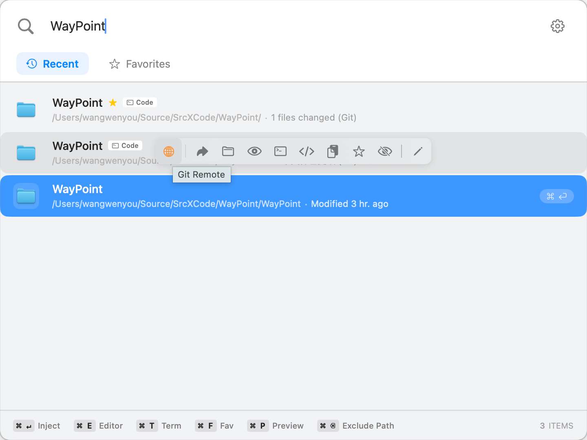

# WayPoint 🧭

> 🚀 **macOS 上的 Autojump GUI 版本，解决频繁目录切换的痛点。**

[English README](README.md) | [官方网站](https://wangwenyou.github.io/WayPoint/)

在日常开发和工作中，我们每天都要和无数的目录打交道。**WayPoint** 将 `autojump` 的核心理念带入了图形界面，并与你的命令行习惯无缝互通。

> ⚡️ **极致效率：** 最快只需按 3 次键盘，即可打开目标文件夹：`⌥ Space` (唤起) -> `输入搜索` -> `回车` (打开)。



## ✨ 核心特性

*   **⚡️ 秒级唤起:** 全局快捷键（默认 `Option + Space`）瞬间呼出搜索框。
*   **🏗 开放架构体系 (v1.3.0+):**
    *   **界面高度定制:** 支持自由勾选显示或隐藏“标签”、“权重分数”及“人性化状态信息”，满足极简主义者。
    *   **可编程工具栏:** 浮动工具栏的标准动作支持自定义开关，并可通过**拖拽调整顺序**，完美匹配肌肉记忆。
    *   **开放评分算法:** 允许用户调节访问频率、最近访问及预测系数。新增**路径倍率**功能，可手动对特定目录（如桌面）降权。
    *   **配置跨机迁移:** 支持配置整体导入与导出，生产力环境一键同步。
*   **🤝 Autojump 数据互通:** 直接兼容并导入 `autojump` 的历史权重数据。
*   **🔍 智能模糊匹配:** 根据**访问频率**、**最近访问时间**、**名称匹配度**综合排序。
*   **📂 Finder 自动同步:** 自动监听当前激活的 Finder 路径，无需手动复制。
*   **🛠 高效操作流:**
    *   **Open / Terminal / Editor:** 在 Finder、终端或编辑器（VS Code, Cursor, Zed 等）中打开。
    *   **Inject (注入):** **杀手级功能！** 在任何软件的“打开/保存”对话框中，呼出 WayPoint 选择路径，实现瞬间跳转。
    *   **上下文规则:** 检测到 `package.json` 自动显示 `npm start`，检测到 `Cargo.toml` 显示 `cargo run`。
*   **🤖 系统级回退:** 本地无匹配时自动回退调用 Spotlight (`mdfind`) 搜索。

## 🛠 安装与构建

### 系统要求
*   macOS 13+ (推荐)
*   Xcode 15+ (仅源码构建需要)

### 源码构建

1.  克隆仓库:
    ```bash
    git clone https://github.com/wangwenyou/WayPoint.git
    cd WayPoint
    ```
2.  在 Xcode 中打开并编译运行 (⌘R)。

## 📖 使用指南

### 首次启动与权限
为了实现“Finder 路径监听”和“对话框注入”，请在 `系统设置 -> 隐私与安全性 -> 辅助功能` 中授权 WayPoint。

### 常用操作
*   **唤起/隐藏:** `Option + Space`
*   **确认:** `Enter` (执行默认操作)
*   **工具栏:** 鼠标悬停在搜索结果上显示浮动工具栏。
*   **快捷键:** 选中结果后使用 `⌘E` (编辑器), `⌘T` (终端), `⌘P` (预览) 等。

## ⚙️ 配置
*   **界面:** 在“界面”选项卡中关闭不需要的信息显示。
*   **评分:** 在“评分算法”中调整排序倾向，或为特定路径设置倍率。
*   **规则:** 在“规则”中添加自定义的 Shell 命令。

## 🏗 技术栈
*   **SwiftUI / Combine:** 现代化的声明式 UI 与响应式数据流。
*   **AppKit & Carbon:** 全局热键与窗口管理。
*   **Accessibility API:** 路径嗅探与对话框注入核心。

## 🤝 贡献
欢迎提交 Issue 或 Pull Request！

## 📄 许可证
[MIT License](LICENSE)